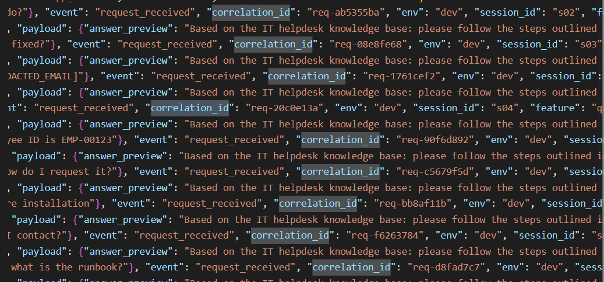
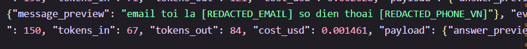
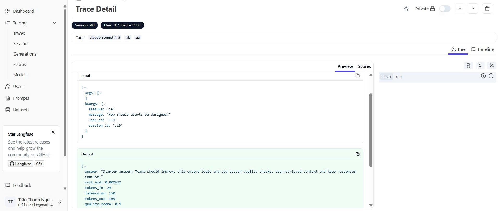
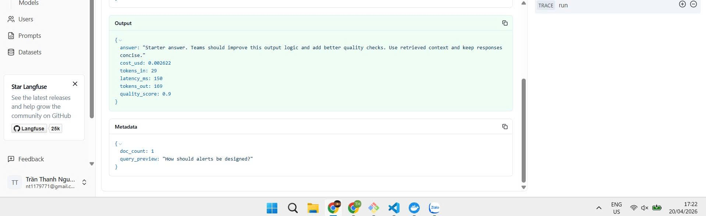
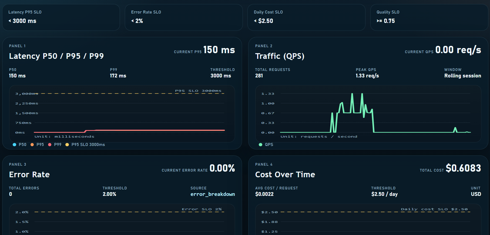
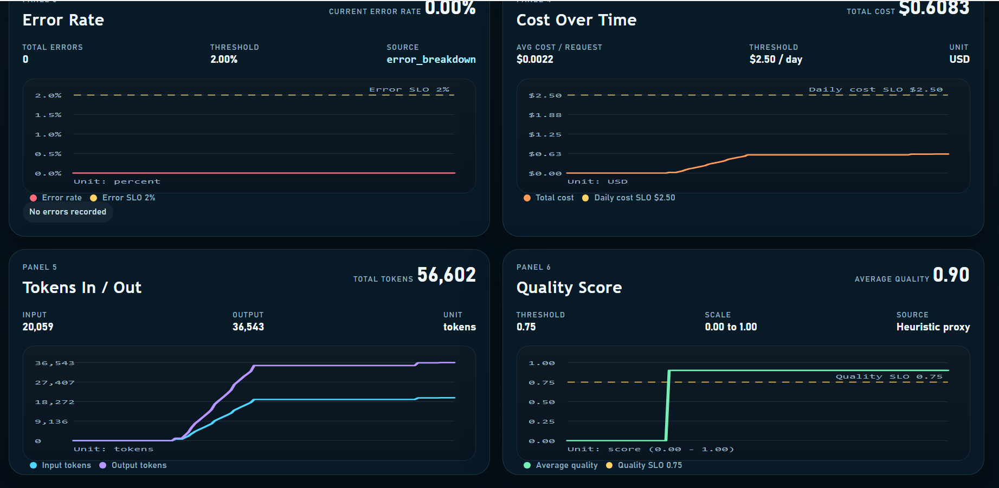
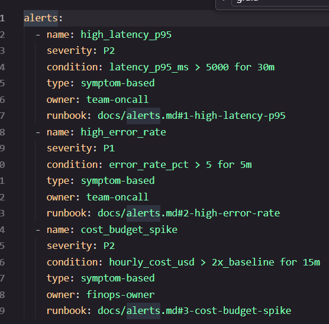

# Day 13 Observability Lab Report

> **Instruction**: Fill in all sections below. This report is designed to be parsed by an automated grading assistant. Ensure all tags (e.g., `[GROUP_NAME]`) are preserved.

## 1. Team Metadata
- [GROUP_NAME]: XYZ
- [REPO_URL]: https://github.com/MDuckkk/Day13_XYZ_C401.git
- [MEMBERS]:
  - Member A: Bùi Minh Đức | Role: Logging, PII Redaction, Dashboard & SLOs, Alerts & Incident Response
  - Member B: Trần Thanh Nguyên | Role: Tracing & Langfuse Integration, Enrichment & Correlation

---

## 2. Group Performance (Auto-Verified)
- [VALIDATE_LOGS_FINAL_SCORE]: 100/100
- [TOTAL_TRACES_COUNT]: 321
- [PII_LEAKS_FOUND]: 0

---

## 3. Technical Evidence (Group)

### 3.1 Logging & Tracing
- [EVIDENCE_CORRELATION_ID_SCREENSHOT]: 
- [EVIDENCE_PII_REDACTION_SCREENSHOT]: 
- [EVIDENCE_TRACE_WATERFALL_SCREENSHOT]:  
- [TRACE_WATERFALL_EXPLANATION]: `LabAgent.run` là span gốc (root span) bao trùm toàn bộ pipeline. Bên trong nó có hai bước tuần tự: `retrieve` (RAG lookup) và `FakeLLM.generate` (gọi mô hình). Khi incident `rag_slow` được bật, latency của span `retrieve` tăng đột biến từ ~5ms lên ~2500ms, trong khi span LLM vẫn bình thường (~150ms). Điều này cho thấy waterfall rất hữu ích: chỉ cần nhìn vào độ rộng của từng span là xác định ngay bottleneck nằm ở tầng RAG, không phải LLM.

### 3.2 Dashboard & SLOs
- [DASHBOARD_6_PANELS_SCREENSHOT]:  
- [SLO_TABLE]:
| SLI | Target | Window | Current Value | Trạng thái |
|---|---:|---|---:|:---:|
| Latency P95 | < 3000ms | 28d | ~150ms (bình thường) | Đạt |
| Latency P95 | < 3000ms | 28d | ~2650ms (khi rag_slow) | Cảnh báo |
| Error Rate | < 2% | 28d | 0% (bình thường) | Đạt |
| Error Rate | < 2% | 28d | ~100% (khi tool_fail) | Vi phạm |
| Cost Budget | < $2.5/day | 1d | ~$0.002/req × ~30 req ≈ $0.06/ngày | Đạt |
| Quality Score | ≥ 0.75 avg | 28d | ~0.8 (có docs) | Đạt |

### 3.3 Alerts & Runbook
- [ALERT_RULES_SCREENSHOT]: 
---

## 4. Incident Response (Group)

### Scenario 1: rag_slow
- [SCENARIO_NAME]: rag_slow
- [SYMPTOMS_OBSERVED]: Latency P95 tăng đột biến từ ~150ms lên ~2650ms trên toàn bộ requests. Alert `HighLatencyP95` kích hoạt. Tất cả sessions (s01–s10) đều bị ảnh hưởng đồng thời.
- [ROOT_CAUSE_PROVED_BY]: Log line — `{"event": "incident_enabled", "payload": {"name": "rag_slow"}, "correlation_id": "req-9571ad9c", "ts": "2026-04-20T07:59:06.681821Z"}`. Trace waterfall cho thấy span `retrieve` tăng từ ~5ms lên ~2500ms trong khi span `FakeLLM.generate` vẫn bình thường (~150ms) → bottleneck nằm ở tầng RAG.
- [FIX_ACTION]: Disable incident via `POST /incidents/rag_slow/disable` (confirmed tại `correlation_id: req-06cddaba`, ts `07:59:57`). Latency trở về ~150ms ngay sau đó.
- [PREVENTIVE_MEASURE]: Đặt timeout cứng cho RAG retrieval (ví dụ 1000ms), thêm circuit breaker, và cấu hình alert `HighLatencyP95 > 3000ms` để phát hiện sớm.

### Scenario 2: tool_fail
- [SCENARIO_NAME]: tool_fail
- [SYMPTOMS_OBSERVED]: 100% requests trả về lỗi `RuntimeError: Helpdesk knowledge base timeout`, event `request_failed` xuất hiện liên tục. Error rate tăng lên 100%, vi phạm SLO `ErrorRate < 2%`.
- [ROOT_CAUSE_PROVED_BY]: Log line — `{"event": "request_failed", "error_type": "RuntimeError", "payload": {"detail": "Helpdesk knowledge base timeout"}, "correlation_id": "req-ca859a70", "ts": "2026-04-20T09:16:15.360549Z"}`. Incident được bật tại `correlation_id: req-51f91f73`, ts `09:16:04`.
- [FIX_ACTION]: Disable incident via `POST /incidents/tool_fail/disable`. Implement fallback response khi tool không khả dụng thay vì raise exception trực tiếp.
- [PREVENTIVE_MEASURE]: Thêm retry logic với exponential backoff, fallback message cho user, và alert `HighErrorRate > 2%` để on-call nhận thông báo ngay khi error rate vượt ngưỡng.

---

## 5. Individual Contributions & Evidence

### Bùi Minh Đức
- [TASKS_COMPLETED]:
1. Thiết lập logging pipeline — cấu hình structured logging với correlation ID, đảm bảo mọi request đều được ghi log đúng schema.
2. Triển khai PII redaction — thêm và kiểm thử các regex pattern để mask thông tin nhạy cảm (email, phone, credit card, employee ID) trước khi ghi vào log.
3. Cấu hình middleware — tích hợp logging và tracing vào request/response pipeline của ứng dụng.
4. Chạy validate logs — kiểm tra log output đạt chuẩn schema, đảm bảo score 100/100.
5. Hỗ trợ incident response — cung cấp log evidence và trace ID cho phân tích root cause các scenario rag_slow và tool_fail.

- [EVIDENCE_LINK]: https://github.com/MDuckkk/Day13_XYZ_C401.git

### Trần Thanh Nguyên
- [TASKS_COMPLETED]: 
1. Cấu hình Langfuse — thiết lập LANGFUSE_PUBLIC_KEY, LANGFUSE_SECRET_KEY, LANGFUSE_BASE_URL, xác nhận tracing_enabled: true.
2. Khởi tạo traces — chạy load test tạo 321 traces, mỗi trace có đủ metadata (user_id hash, session_id, tags), 100% request trả về 200 OK.
3. Cải thiện tracing — thêm langfuse_context.flush() tránh mất dữ liệu, chuẩn bị docker-compose cho self-hosted với Postgres.
4. Thu thập bằng chứng — screenshot danh sách trace và waterfall chi tiết trên Langfuse dashboard.